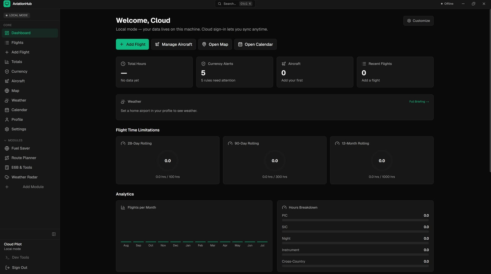
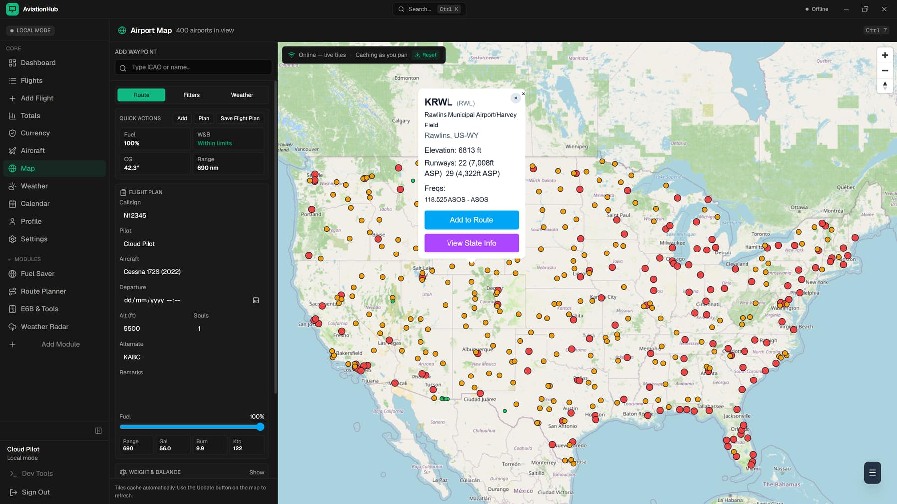
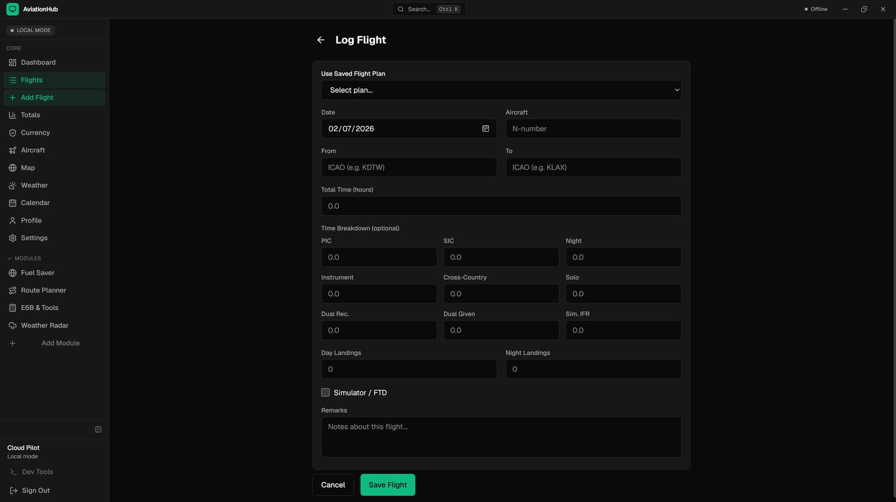
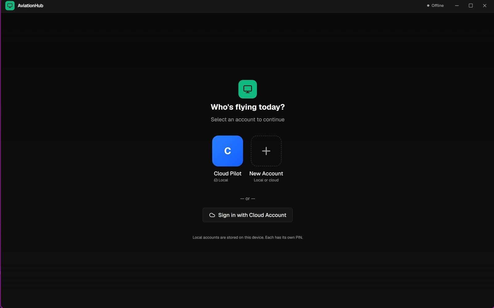

<p align="center">
  
</p>

<h1 align="center">AviationHub</h1>

<p align="center">
  A modern pilot logbook &amp; flight planner for Windows.<br/>
  Offline-first, encrypted backups, and built for pilots who actually fly.
</p>

<p align="center">
  <a href="https://github.com/masterkoster/AviationHub/actions/workflows/desktop-boundary.yml"></a>
  <a href="https://github.com/masterkoster/AviationHub/releases/latest"></a>
  <a href="https://github.com/masterkoster/AviationHub/releases/latest"></a>
  <a href="#"></a>
  <a href="#"></a>
  <a href="LICENSE"></a>
</p>

<p align="center">
  <a href="#-download"><b>↓ Download</b></a> · <a href="#-screenshots">Screenshots</a> · <a href="#-features">Features</a> · <a href="#-quick-start">Quick Start</a> · <a href="CHANGELOG.md">Changelog</a>
</p>

---

AviationHub is a desktop application that brings your pilot logbook, flight
planning, currency tracking, and aircraft management into one fast, offline-first
app. Your data stays on your machine — no account required, no cloud lock-in.
Sign in only if you want to sync across devices.

> **Web version coming soon.** A browser-based experience is in development.
> In the meantime, download the Windows desktop app below.

## 📸 Screenshots

<p align="center">
  
  <br/><sub><b>Dashboard</b> — totals, currency status, and recent flights at a glance.</sub>
</p>

<p align="center">
  
  <br/><sub><b>Interactive Map</b> — 20,000+ airports with fuel prices, frequencies, and runway info.</sub>
</p>

<p align="center">
  
  <br/><sub><b>Logbook entry</b> — full time breakdowns (PIC, SIC, night, instrument, cross-country).</sub>
</p>

<p align="center">
  
  <br/><sub><b>Account picker</b> — local mode (offline, PIN-protected) or cloud sync.</sub>
</p>

## ✨ Features

| | | |
|---|---|---|
| 📓 **Pilot Logbook** — Log flights with full time breakdowns (PIC, SIC, night, instrument, cross-country). Search and filter your entire history. | 🗺️ **Interactive Map** — Explore 20,000+ airports with fuel prices, frequencies, and runway info. Plan routes visually with waypoints. | ⚖️ **Weight & Balance** — Built-in W&B calculator with CG visualization. Pre-flight planning made simple. |
| 🛡️ **Currency Tracking** — FAA currency rules computed from your logbook: night landings, IPC, BFR, medical. Always know your status. | ⛽ **Fuel Planning** — Compare fuel prices, calculate range, and find the cheapest stops along your route. | 🌦️ **Route Weather** — METAR, TAF, and wind aloft for your entire route. See fuel impact from headwinds. |
| 🔌 **Offline-First** — Works entirely offline. Your data stays on your machine. No account required. | 🔐 **Encrypted Backups** — Export and import your data with `.ahb` encrypted backup files. | ⌨️ **Keyboard Shortcuts** — `Ctrl+1`–`8` for rapid navigation, `Ctrl+K` command palette. |

<details>
<summary><b>More</b></summary>

- **Aircraft management** — CRUD with N-number tracking, status, inspections, and maintenance.
- **Calendar/agenda** for event tracking.
- **Route planner** with GPX/FPL/JSON import & export.
- **Auto-updater** with in-app update banner.
- **Themes** — Light, Dark, System.
- **Cloud mode** (optional) — sync across devices.

</details>

## ↓ Download

[](https://github.com/masterkoster/AviationHub/releases/latest)

1. Grab the latest NSIS installer (`.exe`) from [Releases](https://github.com/masterkoster/AviationHub/releases/latest).
2. Run the `.exe`.
3. If Windows SmartScreen appears, click **More info → Run anyway** (code-signing certificate is pending).
4. Follow the setup wizard.

**System requirements:** Windows 10+ · 64-bit · 4GB RAM (8GB recommended) · ~200MB disk

## 🧩 Two Modes

| Mode | Description |
|------|-------------|
| **Local Mode** | Data stays on your machine. No account required. Works completely offline. Protected with a PIN. |
| **Cloud Mode** | Sign in to sync across devices. Access your logbook from the desktop app and (soon) the web. |

## 🚀 Quick Start (Development)

```bash
git clone https://github.com/masterkoster/AviationHub.git
cd AviationHub
npm install
npm run dev         # Next.js dev server (http://localhost:3000)
npm run tauri:dev   # Tauri desktop app
```

**Build:**
```bash
npm run build         # Next.js
npm run tauri:build   # Tauri desktop app (produces the Windows installer)
```

**Prerequisites:** Node.js 20+, Rust toolchain, Windows SDK (for NSIS builds).

## 📁 Project Structure

```
AviationHub/
├─ app/                  # Next.js App Router (web + desktop routes)
│  ├─ desktop/           # Desktop app pages (dashboard, logbook, map, …)
│  └─ api/               # API routes (cloud sync, auth)
├─ apps/                 # Monorepo targets (in migration)
│  ├─ web/               # (planned) dedicated web runtime
│  ├─ desktop/           # (planned) dedicated desktop runtime
│  └─ api/               # (planned) dedicated API service
├─ components/           # Shared React UI (shadcn/ui based)
├─ desktop/              # Desktop-only components, hooks, lib
├─ src-tauri/            # Tauri v2 backend (Rust, SQLite migrations)
├─ prisma/               # Prisma schema & migrations
├─ docs/                 # Plans, guides, and the GitHub Pages site
│  └─ screenshots/       # Compressed screenshots used here & on the site
└─ public/               # Static assets & icons
```

## 🧱 Tech Stack

- **Frontend:** Next.js 16 (App Router), React 19, Tailwind CSS v4, shadcn/ui
- **Desktop:** Tauri v2 (Rust backend)
- **Database:** SQLite (via Tauri SQL plugin) · Prisma (cloud)
- **Auth:** NextAuth.js
- **Maps:** MapLibre GL + Leaflet

## 🗺️ Roadmap

- [x] Desktop app (Windows, NSIS installer)
- [x] Offline-first local mode with PIN + encrypted backups
- [x] Logbook, map, W&B, fuel, weather, currency, aircraft
- [ ] Code-signing certificate (removes SmartScreen warning)
- [ ] Web app (browser-based experience)
- [ ] macOS / Linux builds

## 📚 Documentation

- [Changelog](CHANGELOG.md) — what's new
- [Desktop app README](apps/desktop/README.md) — desktop-only details & shortcuts
- [Deploy guide](DEPLOY.md)
- [`docs/`](docs) — architecture plans, data pipeline, and setup guides

## 📄 License

Proprietary. All rights reserved. See [LICENSE](LICENSE) for details.

---

<p align="center">
  Built for pilots, by a pilot. ✈️
</p>
